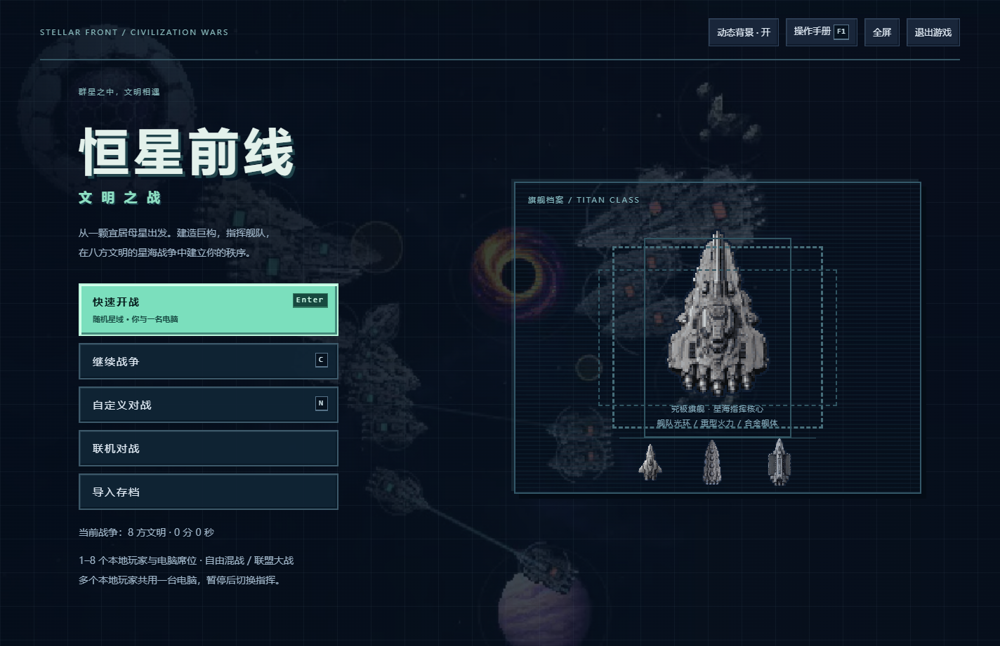

# 恒星前线 · 星际 RTS

经营星区工业、建设设施、研究科技，指挥舰队争夺星际前线。

**Windows 可玩原型 · 0.16.0**

## 下载与启动

**[下载 Windows 64 位免安装版](https://github.com/OGAS19171976/stellar-front-rts/releases/download/v0.16.0/StellarFront-0.16.0-Windows-x64.zip)**

完整解压 ZIP，打开“恒星前线-0.16.0-Windows-x64”文件夹，双击 **恒星前线.exe**。请保留整个文件夹。

[操作说明](https://github.com/OGAS19171976/stellar-front-rts/releases/download/v0.16.0/StellarFront-0.16.0-Guide.md) · [全部版本与下载](https://github.com/OGAS19171976/stellar-front-rts/releases/latest) · [SHA-256 校验值](SHA256SUMS.txt)

程序自带运行环境，单机可离线游玩，无需安装浏览器或 Node.js。

## 游戏内容

- 固定俯视舰队即时战略，统一像素画风与指挥界面。
- 八种文明、2～8 方对战、11 类地图，可设置电脑、联盟与地图种子。
- 21 种舰船、36 种设施、7 种天体、35 项科技。
- 工程船建设、矿物/能源/合金经济、船坞队列、并行科研和数字编组。
- 终局巨构、超级武器、可争夺遗迹和星际长城。
- 单机存档、导入导出，以及局域网或虚拟局域网联机。

## 开始指挥

Enter 快速开战，N 自定义，C 继续，F1 操作手册。

左键选择、右键下令，Ctrl+数字编组、数字选组，Shift+右键追加指令。F2 全部战斗舰、F3 科学枢纽、F4 工程船。船坞和科研面板显示各自快捷键；Shift 可批量排产，Del 取消末项。

## 联机与存档

主菜单进入联机对战。房主创建房间，朋友输入房主地址和六位房间码。所有参与者使用同版；支持局域网和虚拟局域网，最多八方玩家或电脑。

存档保存在当前 Windows 用户目录，单机与联机分别保存。菜单可导出、导入 JSON 存档；更新前关闭旧版本。

## 本次发布检查

187 项规则测试通过。已验证独立程序启动、全屏、编组、存档导入导出、重启恢复、八方对战和游牧设施状态恢复。264 份运行源码/资源和九份说明与开发版本一致，下载 ZIP 的每个文件已校验。

此仓库提供下载说明与发布文件。第三方运行环境许可证随运行包附带。
